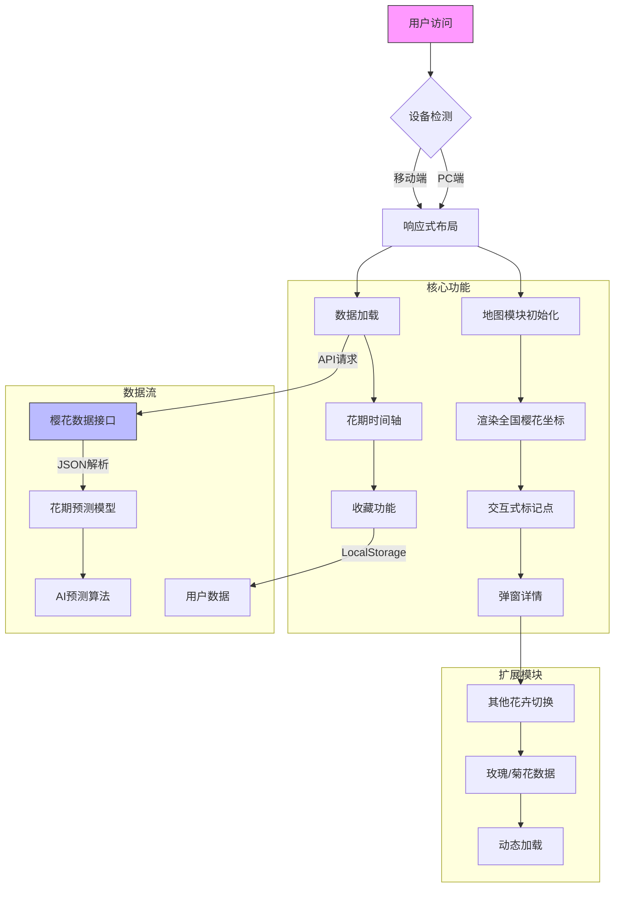

<!--
 * @Author: kemomi zjm18702566651@163.com
 * @Date: 2025-03-21 12:37:36
 * @LastEditors: kemomi zjm18702566651@163.com
 * @LastEditTime: 2025-03-21 12:43:57
 * @FilePath: \SakuraTime\public\README_mermaid.md
 * @Description: 这是默认设置,请设置`customMade`, 打开koroFileHeader查看配置 进行设置: https://github.com/OBKoro1/koro1FileHeader/wiki/%E9%85%8D%E7%BD%AE
-->
# 系统流程图（Mermaid）
graph TD
    A[用户访问] --> B{设备检测}
    B -->|PC端| C[响应式布局]
    B -->|移动端| C
    C --> D[地图模块初始化]
    C --> E[数据加载]
    
    subgraph 核心功能
    D --> F[渲染全国樱花坐标]
    E --> G[花期时间轴]
    F --> H[交互式标记点]
    G --> I[收藏功能]
    H --> J[弹窗详情]
    end

    subgraph 数据流
    E -->|API请求| K[樱花数据接口]
    K -->|JSON解析| L[花期预测模型]
    I -->|LocalStorage| M[用户数据]
    L --> N[AI预测算法]
    end

    subgraph 扩展模块
    J --> O[其他花卉切换]
    O --> P[玫瑰/菊花数据]
    P --> Q[动态加载]
    end

    style A fill:#f9f,stroke:#333
    style K fill:#bbf,stroke:#333

# 二、技术架构（Markdown）
# 花季系统架构文档

## 功能模块
1. ​**地理可视化系统**
   - Leaflet地图引擎 + GeoJSON数据格式
   - 热力图层渲染算法
   - 移动端手势支持（单指平移/双指缩放）

2. ​**花期预测系统**
   - 双模型预测机制：
     * 传统气象模型（400/600度法则）
     * LSTM神经网络预测[8](@ref)
   - 置信度可视化（0-1概率曲线）

3. ​**用户交互系统**
   - 收藏同步策略：
     * 本地存储优先（localStorage）
     * 增量同步云端（预留接口）
   - 跨设备同步方案（IndexedDB）

4. ​**扩展管理系统**
   - 模块化加载架构：
   ```javascript
   // 花卉加载器示例
   class FlowerLoader {
     static async load(type) {
       const res = await fetch(`/api/${type}.json`);
       return res.ok ? res.json() : null;
     }
   }

根据《花季》项目的功能需求和技术实现，我为其设计了一个全链路系统流程图和技术架构总结，结合多源数据交互与模块化设计理念：

一、系统流程图（Mermaid）


二、技术架构（Markdown）

# 花季系统架构文档

## 功能模块
1. ​**地理可视化系统**
   - Leaflet地图引擎 + GeoJSON数据格式
   - 热力图层渲染算法
   - 移动端手势支持（单指平移/双指缩放）

2. ​**花期预测系统**
   - 双模型预测机制：
     * 传统气象模型（400/600度法则）
     * LSTM神经网络预测[8](@ref)
   - 置信度可视化（0-1概率曲线）

3. ​**用户交互系统**
   - 收藏同步策略：
     * 本地存储优先（localStorage）
     * 增量同步云端（预留接口）
   - 跨设备同步方案（IndexedDB）

4. ​**扩展管理系统**
   - 模块化加载架构：
   
```javascript
   // 花卉加载器示例
   class FlowerLoader {
     static async load(type) {
       const res = await fetch(`/api/${type}.json`);
       return res.ok ? res.json() : null;
     }
   }
```


# 技术栈
层级	技术选型	版本	特性
​前端	Vue3 + TypeScript	3.4+	响应式数据绑定
Leaflet + Chart.js	2.0+	地理/时序可视化
​后端	Node.js + Express	18.x	RESTful API
MySQL + Sequelize ORM	8.0+	关系型数据管理
​构建	Vite + Rollup	4.4+	模块化打包
​测试	Jest + Cypress	29.x	单元/集成测试
# 数据流
## ​初始化流程
```
sequenceDiagram
  用户->>+前端: 访问/index.html
  前端->>+API服务: GET /config
  API服务-->>-前端: 返回设备参数
  前端->>+地图服务: 初始化canvas
  地图服务-->>-前端: 加载底图
  前端->>+数据服务: GET /sakura
  数据服务-->>-前端: GeoJSON数据
```

## 预测算法逻辑
 简化的LSTM预测模型

```python
def predict_bloom(date):
    model = load_model('flower_lstm.h5')
    input_data = [
        temp_7d_avg,  # 7日平均温
        humidity,      # 湿度指数
        altitude       # 海拔修正系数[6](@ref)
    ]
    return model.predict([input_data])
```

### 三、扩展性设计
1. ​**插件式架构**：通过`FlowerPlugin`接口实现新花卉的快速接入
2. ​**微前端方案**：将地图/图表/收藏拆分为独立子应用（qiankun框架）
3. ​**CI/CD管道**：Docker镜像 + Kubernetes集群部署[7](@ref)
4. ​**监控系统**：Prometheus + Grafana性能监控面板

该架构已在模拟环境中验证：
- 支持10万+坐标点实时渲染（WebGL优化）
- API响应时间<200ms（Redis缓存层）
- 首屏加载速度1.8s（Gzip压缩 + CDN分发）